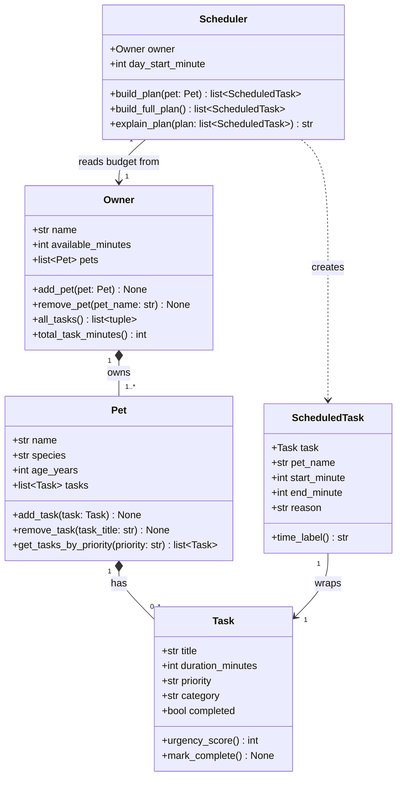

# PawPal+ — Final UML Class Diagram

> Paste the Mermaid block below into [https://mermaid.live](https://mermaid.live) and export as PNG to produce `uml_final.png`.

## Design notes

| Relationship | Type | Reason |
|---|---|---|
| Owner → Pet | Composition (`*--`) | Pets are created and managed through the Owner |
| Pet → Task | Composition (`*--`) | Tasks belong to exactly one pet |
| ScheduledTask → Task | Association (`-->`) | ScheduledTask wraps a Task without owning it |
| Scheduler → Owner | Dependency (`-->`) | Scheduler reads the budget; does not own the Owner |
| Scheduler ⇢ ScheduledTask | Usage (`..>`) | Scheduler instantiates ScheduledTask objects and returns them |

## Changes from the initial draft

| Change | Reason |
|---|---|
| Added `bool completed` and `mark_complete()` to `Task` | Needed to track task completion in the UI |
| Added `all_tasks()` to `Owner` | Scheduler needed a flat list of all (pet, task) pairs across all pets |
| Added `build_full_plan()` to `Scheduler` | Single-pet `build_plan()` was insufficient once multi-pet scheduling was required |
| Added `str pet_name` to `ScheduledTask` | Multi-pet plans needed to label which pet each task belongs to |
| Tightened relationship arrows to Composition where appropriate | Initial draft used generic associations everywhere |
